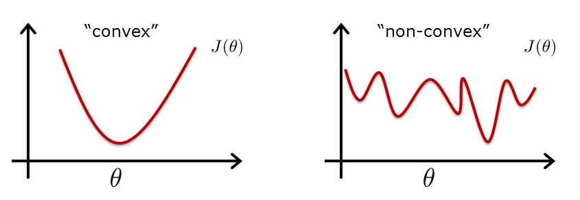

# Optimisation 

---
# Motivation

We want to find $a$ and $b$ which minimize the sum square errors $J$ which is given by
$$ J(a,b) =\frac{1}{2} \sum_{i=1}^{n} (y_i-(ax_i+b))^2$$

--- 
# The build-up

- Interactively create a dummy data in excel (data **A**)
- Visualise how different choices of slopes and intercept will affect the error
- Gradient descent applied to one variable function 
- Gradient descent applied to two variables function (using **A**) 
- How can we check our results numerically? 
- **Exercise**: Using the built-up knowledge so far to estimate the coeffients of: 
	- linear regression on real dataset. 
	- logistic regression on real dataset. 

*Note: This will combine Excel. Pandas, Numpy, and Basic Math knowledge*

---
# Matrix Representation 
Recall that we would like to minimize 
$$ J(a,b) = \frac{1}{2} \sum_{i=1}^{n} (y_i-(ax_i+b))^2$$

Suppose that we have $n$ observations and $m$ features. We can stack these observations in a matrix $X$ with size $n \times m$. 

If $J(\beta) = \frac{1}{2} (y - X\beta)^T (y - X\beta)$, then $\hat{\beta}$ which minimize $J$ is given by 
$$ \beta = (X^TX)^{-1}X^Ty$$

---

# Gradient Descent - Intuition

--- 
# Gradient Descent - algorithm

For one variable, the iteration logic is given by: 
$$ 
x_{n+1} = x_n - \eta  Df(x_n)
$$ 
where $Df(x_0)$ means $\frac{df(x)}{dx}$ evaluated at $x=x_0$

If it is extended to multi-variable scheme, then the iteration logic becomes:

$$
\beta_{n+1} = \beta_n - \eta \nabla J(\beta_n)
$$

Remarks: $\eta$ is called *learning rate*.

--- 

# Gradient Descent - algorithm

Recall the cost function of the original problem 
$$ J(a,b) = \frac{1}{2} \sum_{i=1}^{n} (y_i-(ax_i+b))^2$$

Partial derivaties with respect to $a$ and $b$ are given by

$$ \frac{\partial J}  {\partial a} =  \sum_{i=1}^{n} (y_i-(ax_i+b)) (-x_i) $$
and 
$$ \frac{\partial J}  {\partial b} =  \sum_{i=1}^{n} (y_i-(ax_i+b)) (-1) $$

---
# Differences between Convex vs Non-Convex 

---
# Appendix

---
# Derivation of linear regression MLE 

Using the previous notation, we would like to minimize 
 $$J(\beta) = (y - X\beta)^T (y - X\beta)$$ 

Calculating the gradient of $J$ gives us 
$$ \nabla J = 2 \times \nabla (y-X\beta)^T  \times (y-X\beta)  $$

$$ \nabla J = 2 \times (\nabla y^T-\nabla (X\beta)^T ) \times (y-X\beta)  $$

Knowing $\nabla (X\beta)^T = X^T$ and setting gradient to be zero, we get 

$$ 0 = 2 \times -X^T\times (y-X\beta) = -X^Ty+X^TX\beta $$

Moving $-X^T\beta$ to the left hand side and multiplying both sides by $(X^TX)^{-1}$ gives us the solution 

$$ 
	\hat{\beta} = (X^TX)^{-1}X^Ty
$$

